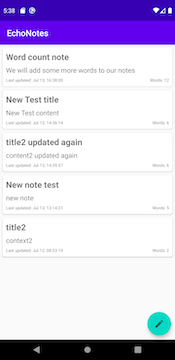
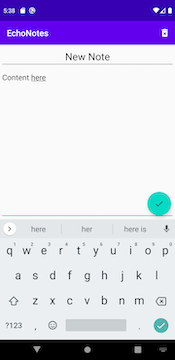
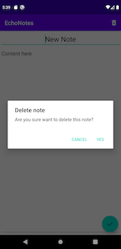

# EchoNotes
Android App: CRUD note taking app that echos notes with time stamp created and word count.

__
__

## Built with:
* Android Studio
* Kotlin
* MVVM
* Coroutines
* Room database
* Code refactoring
* Clean architecture
